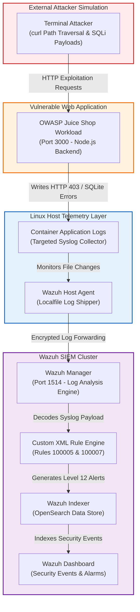

# 🛡️ Containerized SOC Lab & Detection Engineering Pipeline

[](https://wazuh.com/)
[](https://www.docker.com/)
[](https://owasp.org/www-project-juice-shop/)
[](https://attack.mitre.org/techniques/T1190/)

This repository contains a hands-on **Purple Team SOC & Detection Engineering Lab** built on Linux. The project focuses on detecting real-world web application attacks—specifically **Path Traversal / Local File Inclusion (LFI)** and **SQL Injection (SQLi)**—against a vulnerable target application (`OWASP Juice Shop`) hosted in Docker.

Instead of relying on out-of-the-box defaults, I configured the telemetry pipeline from scratch: forwarding container application logs into a local **Wazuh SIEM** cluster, configuring targeted file collectors, and writing custom XML detection rules mapped to the **MITRE ATT&CK Framework** to trigger high-severity alerts in the Wazuh dashboard.

---

## 📐 Architecture & Telemetry Flow

I used Docker to host both the vulnerable web application and the Wazuh SIEM stack on a single machine. The diagram below illustrates how attack traffic is generated, how the application records errors, and how the Wazuh agent ships those logs to the central manager for analysis.



---

## 🎯 What I Built

1. **Building a Local Telemetry Pipeline**: Configured the Wazuh host agent to actively monitor containerized application output and securely forward logs to the Wazuh Manager over port 1514.
2. **Targeted Log Collection**: Structured exact file paths inside the Wazuh agent configuration (`ossec.conf`) to cleanly capture OWASP Juice Shop application telemetry without dropping packets or missing critical application exceptions.
3. **Custom Detection Engineering**: Built specific custom XML rules on the Wazuh Manager (`Rule 100005` and `Rule 100007`) to intercept Directory Traversal and SQL Injection errors and upgrade them from background log noise to **Level 12 Critical Security Alarms**.
4. **Validating Alerts with Live Attacks**: Ran manual attack simulations using `curl` against the web server to verify that every stage of the pipeline—from packet capture to dashboard indexing—worked reliably.

---

## ⚔️ Attack Simulation & Rule Mapping

To prove that the SIEM pipeline accurately identifies different threat vectors, I simulated two classic web exploitation attacks. Here is how each attack works, how the backend responds, and which custom Wazuh rule catches it:

| Attack Vector & Command | How the Attack Works | Application Log Response | Wazuh Detection Rule & MITRE ATT&CK |
| :--- | :--- | :--- | :--- |
| **Directory Traversal / LFI**<br>`curl --path-as-is -s "http://localhost:3000/ftp/../../../../etc/passwd"` | By using `../` directory sequences in the URL path, an attacker tries to escape the public web root and read sensitive operating system files like `/etc/passwd`. | The server rejects the path traversal and writes an HTTP `Forbidden` access error to the container's application log. | **Rule ID 100005**<br>Level 12 Critical Alert<br>[MITRE T1190](https://attack.mitre.org/techniques/T1190/) |
| **SQL Injection (SQLi)**<br>`curl -s "http://localhost:3000/rest/products/search?q=apple'"` | An attacker injects a single quote (`'`) into the search query parameter to break the backend SQLite query logic and force a database error or dump hidden records. | The Node.js backend crashes the query and logs a raw database exception (`SQLITE_ERROR: near "'": syntax error`). | **Rule ID 100007**<br>Level 12 Critical Alert<br>[MITRE T1190.001](https://attack.mitre.org/techniques/T1190/) |

---

## 🛡️ Custom Detection Rules

To catch these specific exploitation attempts, I added custom detection rules to `/var/ossec/etc/rules/juice_shop_rules.xml` on the Wazuh Manager. 

Whenever an application log arrives containing indicators of compromise like `Forbidden` / `etc/passwd` or database syntax errors (`SQLITE_ERROR`), the specific rule triggers a **Level 12 Critical Alert** tagged with MITRE ATT&CK technique **T1190**.

```xml
<group name="custom,juice_shop,">
  <rule id="100005" level="12">
    <if_group>syslog</if_group>
    <match>Forbidden|etc/passwd</match>
    <description>Active Web Exploitation Attempt Detected in Public Application (T1190)</description>
    <mitre>
      <id>T1190</id>
    </mitre>
  </rule>

  <rule id="100007" level="12">
    <if_group>syslog</if_group>
    <match>SQLITE_ERROR|syntax error</match>
    <description>CRITICAL: Active Database SQL Injection (SQLi) Exploit Detected (T1190.001)</description>
    <mitre>
      <id>T1190</id>
    </mitre>
  </rule>
</group>
```

---

## 📸 Verification Screenshots & Proof

Below are the verified portfolio receipts captured during live testing, confirming pipeline health and showcasing the exact dashboard alerts triggered by each attack command.

### 1. Pipeline Health & Active Agent Connection
Confirming stable logcollector communication, host agent connectivity, and raw log ingestion metadata across the Wazuh cluster.

| Agent Status & Connectivity | Pipeline Ingestion & Decoder Analysis | Event Metadata Discovery |
| :---: | :---: | :---: |
|  |  |  |

---

### 2. Threat Hunting & Active Attack Verification

Below is the live verification proving that executing specific terminal attack commands immediately triggers corresponding Level 12 Critical Security Alarms in the Wazuh dashboard.

#### A. Active Web Exploitation (Directory Traversal / LFI)
**Simulated Terminal Attack Command:**
```bash
curl --path-as-is -s "http://localhost:3000/ftp/../../../../etc/passwd"
```

**Resulting Wazuh SIEM Alert (`Active Web Exploitation Attempt Detected`):**


---

#### B. Active Database SQL Injection (SQLi)
**Simulated Terminal Attack Command:**
```bash
curl -s "http://localhost:3000/rest/products/search?q=apple'"
```

**Resulting Wazuh SIEM Alert (`Active Database SQL Injection Exploit Detected`):**


---

## 🔬 Lessons Learned

* **Precise Log Formatting**: When configuring file collectors in `ossec.conf`, ensuring clean location paths and proper log formatting (`syslog`) is critical. Small syntax typos in configuration paths can disrupt collector threads or prevent logs from reaching the manager queue.
* **Tuning Decoder Sensitivity**: Default SIEM decoders often treat standard application web errors as low-level informational events (Level 3 or below), which are hidden from main security dashboards. Writing targeted custom XML rules is essential to promote real attack indicators to visible, actionable alarms.

---

## 🚀 How to Run Locally

If you want to spin up this lab on your own Linux machine:

```bash
# 1. Clone the repository
git clone https://github.com/yourusername/SOC-ATTACK-LAB.git
cd SOC-ATTACK-LAB

# 2. Start Wazuh SIEM cluster and target web app
cd wazuh-docker/single-node && docker compose up -d
cd ../../juice-shop && docker compose up -d

# 3. Verify custom detection rules are loaded
docker compose exec wazuh.manager bash -c "cat /var/ossec/etc/rules/juice_shop_rules.xml"

# 4. Fire test attacks from your terminal
curl --path-as-is -s "http://localhost:3000/ftp/../../../../etc/passwd"
curl -s "http://localhost:3000/rest/products/search?q=test'"
```
